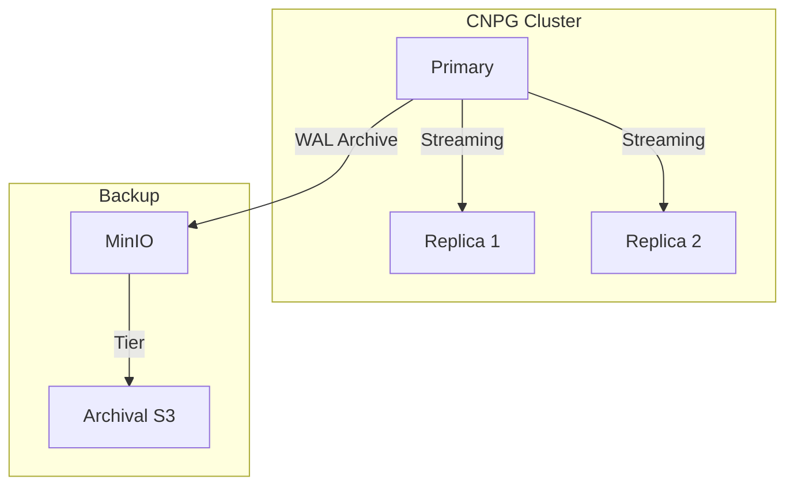
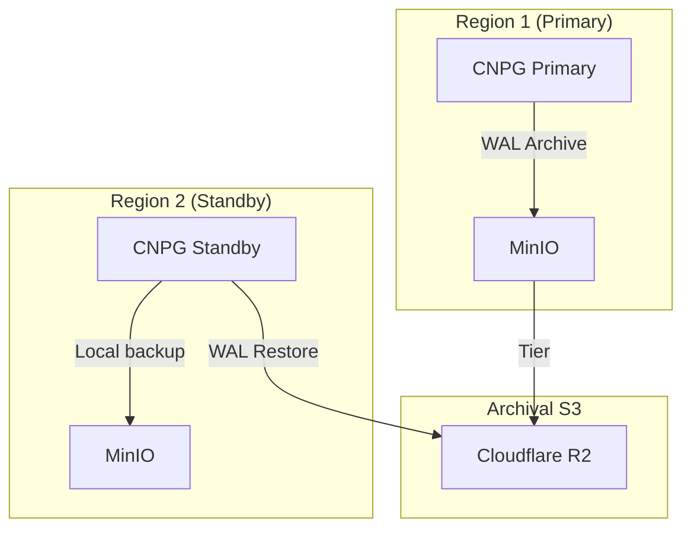
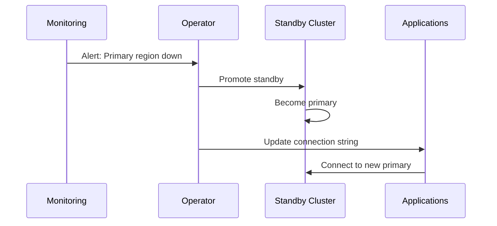

# ADR: PostgreSQL with CloudNativePG

**Status:** Accepted
**Date:** 2024-04-01
**Updated:** 2026-01-16

## Context

Need managed PostgreSQL for relational data with multi-region disaster recovery support.

## Decision

Use **CloudNativePG (CNPG)** operator for PostgreSQL management with WAL streaming for cross-region DR.

## Architecture

### Single Cluster (Within Region)



### Multi-Region DR (WAL Streaming)



## DR Strategy: WAL Streaming

CNPG supports cross-region disaster recovery via WAL (Write-Ahead Log) streaming:

1. **Primary cluster** archives WAL to object storage
2. **Standby cluster** in DR region restores WAL continuously
3. **Near-realtime replication** (seconds of lag)
4. **Promotion** when primary fails

### Replication Lag

| Scenario | Typical Lag |
|----------|-------------|
| Normal operation | < 5 seconds |
| High write load | < 30 seconds |
| Network issues | Minutes |

## Configuration

### Primary Cluster

```yaml
apiVersion: postgresql.cnpg.io/v1
kind: Cluster
metadata:
  name: <tenant>-postgres
  namespace: databases
spec:
  instances: 3

  storage:
    size: 50Gi
    storageClass: <storage-class>

  postgresql:
    parameters:
      max_connections: "200"
      shared_buffers: "256MB"

  backup:
    barmanObjectStore:
      destinationPath: s3://backups/<tenant>/postgres
      endpointURL: http://minio.storage:9000
      s3Credentials:
        accessKeyId:
          name: minio-credentials
          key: ACCESS_KEY_ID
        secretAccessKey:
          name: minio-credentials
          key: SECRET_ACCESS_KEY
      wal:
        compression: gzip
        maxParallel: 2
    retentionPolicy: "30d"

  externalClusters:
    - name: <tenant>-postgres-dr
      barmanObjectStore:
        destinationPath: s3://backups/<tenant>/postgres
        endpointURL: https://<account>.r2.cloudflarestorage.com
        s3Credentials:
          accessKeyId:
            name: r2-credentials
            key: ACCESS_KEY_ID
          secretAccessKey:
            name: r2-credentials
            key: SECRET_ACCESS_KEY
```

### Standby Cluster (DR Region)

```yaml
apiVersion: postgresql.cnpg.io/v1
kind: Cluster
metadata:
  name: <tenant>-postgres
  namespace: databases
spec:
  instances: 3

  replica:
    enabled: true
    source: <tenant>-postgres-primary

  storage:
    size: 50Gi

  externalClusters:
    - name: <tenant>-postgres-primary
      barmanObjectStore:
        destinationPath: s3://backups/<tenant>/postgres
        endpointURL: https://<account>.r2.cloudflarestorage.com
        s3Credentials:
          accessKeyId:
            name: r2-credentials
            key: ACCESS_KEY_ID
          secretAccessKey:
            name: r2-credentials
            key: SECRET_ACCESS_KEY
```

## Failover Procedure



### Steps:

1. **Detect failure** via monitoring alerts
2. **Verify data** - check WAL lag before promotion
3. **Promote standby** - remove `replica.enabled: true`
4. **Update DNS/config** - point applications to new primary
5. **Re-establish DR** - set up new standby when old region recovers

## Features

| Feature | Support |
|---------|---------|
| Automatic failover | Within cluster |
| Rolling updates | Zero-downtime |
| Backups | Barman to S3 |
| Point-in-time recovery | WAL archiving |
| Connection pooling | PgBouncer |
| Monitoring | Prometheus metrics |
| Cross-region DR | WAL streaming |

## Consequences

**Positive:**
- K8s-native lifecycle
- Automatic HA within cluster
- Cross-region DR via WAL
- Strong consistency (unlike MongoDB CDC)

**Negative:**
- Operator learning curve
- WAL streaming requires object storage setup
- Manual failover for cross-region

## Related

- [ADR-MULTI-REGION-STRATEGY](../../handbook/docs/adrs/ADR-MULTI-REGION-STRATEGY.md)
- [ADR-OBJECT-STORAGE](../../minio/docs/ADR-OBJECT-STORAGE.md)
